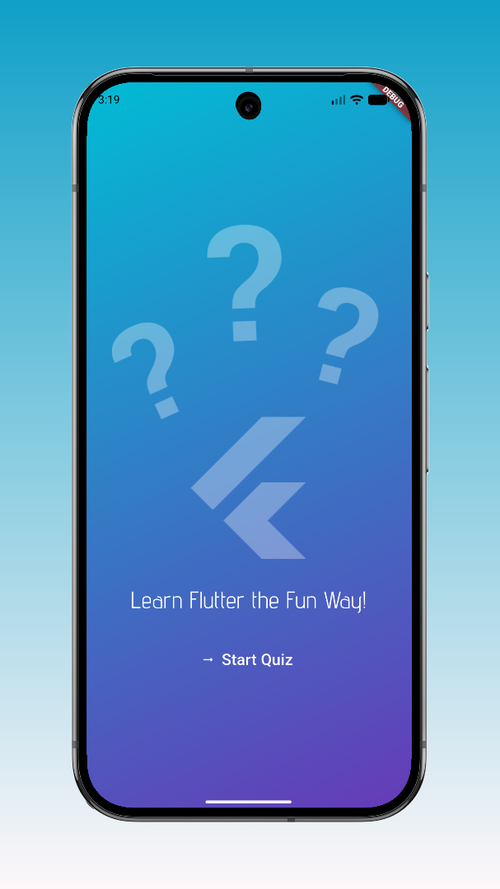
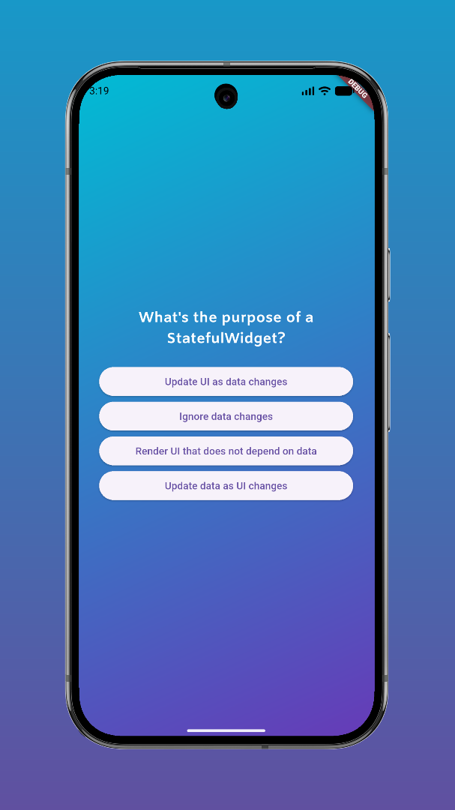
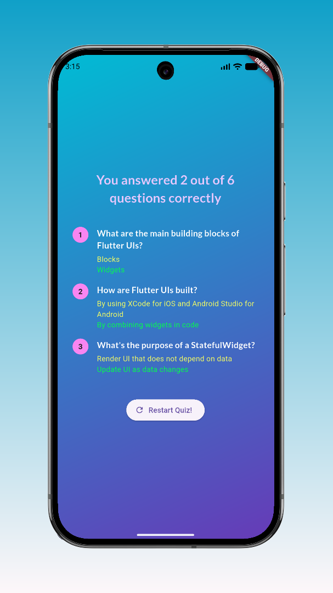

# 📱 Flutter Quiz App

A completed Flutter application built to master foundational Flutter and Dart concepts, including reactive state management, custom data models, list/map operations, and custom UI styling. 

---
## 📸 Screenshots

| Start Screen | Questions Screen | Results Screen |
| :---: | :---: | :---: |
|  |  |  |

## 🎨 App Overview & Features

- **Dynamic Navigation:** Smooth transition from Start Screen $\rightarrow$ Question Screen $\rightarrow$ Results Screen $\rightarrow$ Restart.
- **Randomized Questions:** Shuffles answer options on every run without altering the original dataset.
- **Stateful Answer Tracking:** Captures and stores user selections across screens in real-time.
- **Detailed Results & Analytics:** Summarizes correct vs. chosen answers with filtered statistics and clean UI layouts.
- **Restart Mechanism:** Resets application state and restarts the quiz seamlessly.

---

## 🧠 Key Concepts & Learnings

### 🔄 State & Screen Flow
- **`initState` Lifecycle:** Managed initialization logic when stateful widgets enter the widget tree.
- **Functions as First-Class Citizens:** Passed functions and callback handlers as values across widgets (e.g., passing handlers between `Widget` and `State` classes).
- **Centralized State:** Maintained global quiz state and user answers centrally inside `quiz.dart`.

### 🏗️ Data Modeling & Collections
- **Classes as Blueprints:** Designed structured models (`lib/models/quiz_question.dart`) to decouple raw data from presentation logic.
- **Copying & Memory Mutation:** Practiced non-mutating transformations (e.g., `.map()`) vs. in-place memory mutations (e.g., `.shuffle()`), using list copying (`List.of()`) to keep original data intact.
- **Map Data Types & Type Casting:** Structured result summary dictionaries (`Map<String, Object>`) and used explicit type casting to safely access dynamic values.
- **Filtering with `.where()`:** Leveraged Dart's functional `.where()` method on lists to instantly compute total correct answers for the summary screen.

### 🎨 Advanced UI & Styling
- **Spread Operator (`...`) & Collection `for` Loops:** Dynamically generated widget children lists inside structural layouts.
- **Constraint Management (`Expanded` Widget):** Used `Expanded` to prevent layout overflows and bound dynamic content width within parent flex widgets.
- **Final Visual Polish:** Styled custom typography, button themes, and color gradients across all screens.

---

## 🛠️ Project Structure

```text
lib/
├── data/
│   └── questions.dart          # Raw quiz questions and answers dataset
├── models/
│   └── quiz_question.dart      # Blueprint class for question data
├── screens/
│   ├── start_screen.dart       # Landing screen
│   ├── questions_screen.dart   # Interactive quiz interface
│   └── results_screen.dart     # Summary and score breakdown
├── quiz.dart                   # Main state controller & screen navigator
└── main.dart                   # Application entry point
